# OCCAstft

paper - http://apjcriweb.org/content/vol11no2/40.html


## Overview

This project is a multi-platform (GPGPU) supported implementation of the Short-Time Fourier Transform (STFT). It is designed to perform STFT operations efficiently across various parallel computing environments such as CUDA, OpenCL, OpenMP, and Serial. The project ensures stable execution across diverse systems and deployment environments, making it a reliable and scalable solution for signal processing, particularly for time-frequency analysis of audio and speech signals.

Additionally, the project allows users to request calculations from a server via WebSocket connections, providing flexibility in deployment and usage scenarios.

## Performance

Tested on NVIDIA H100, Ubuntu, CUDA 12.3

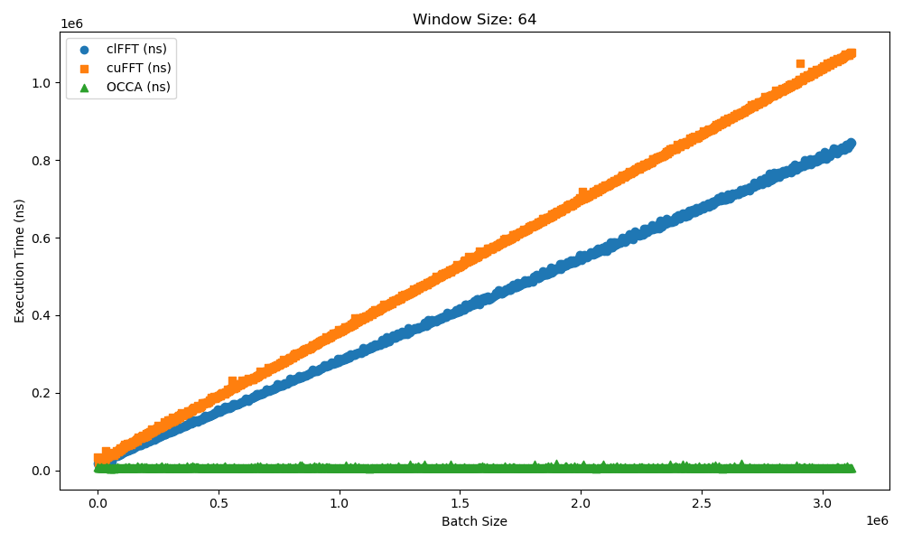
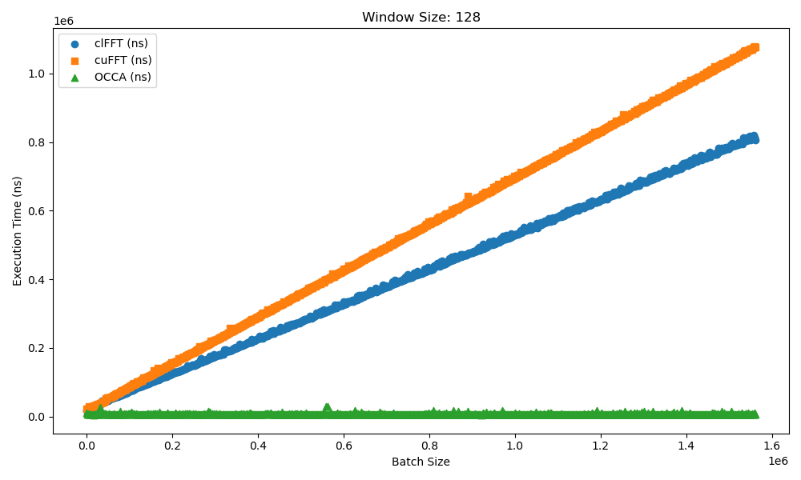
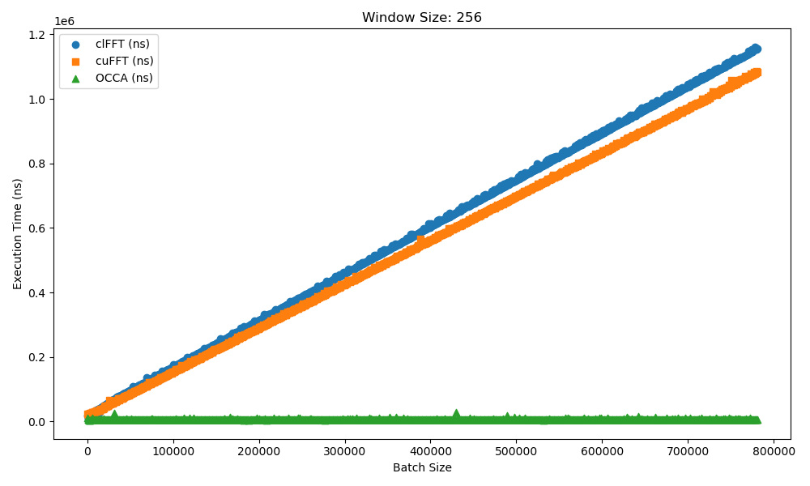
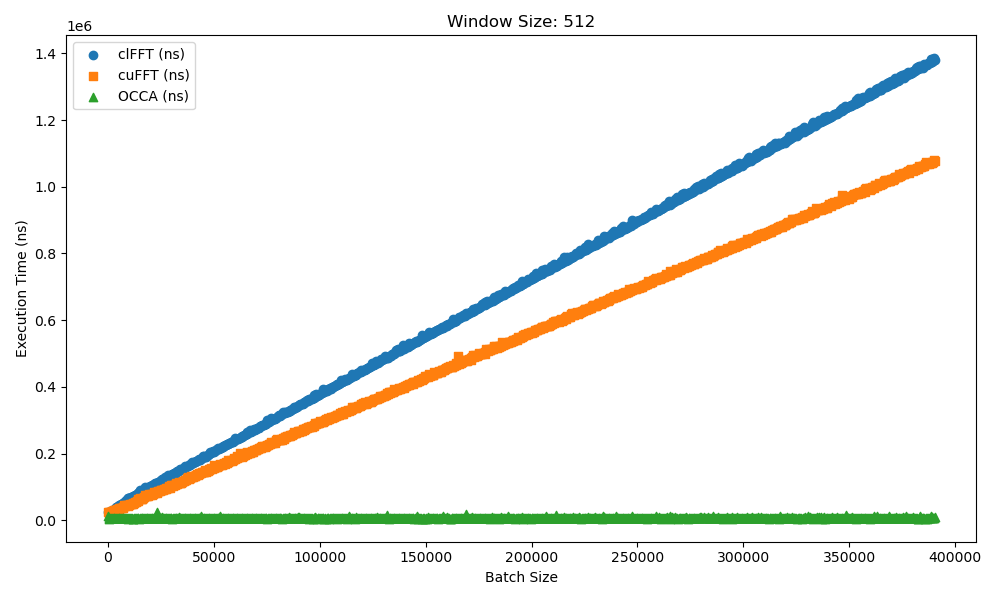
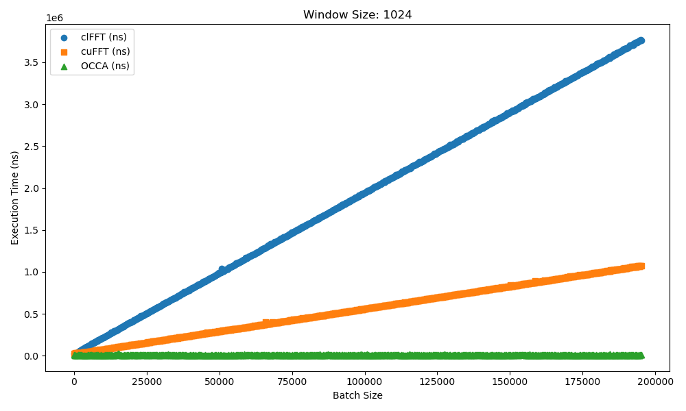

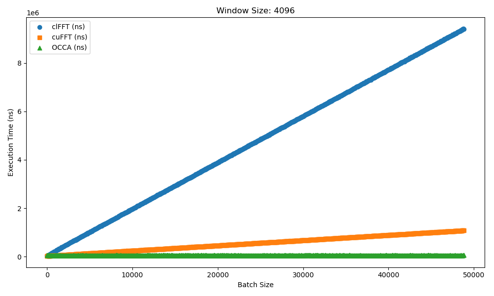
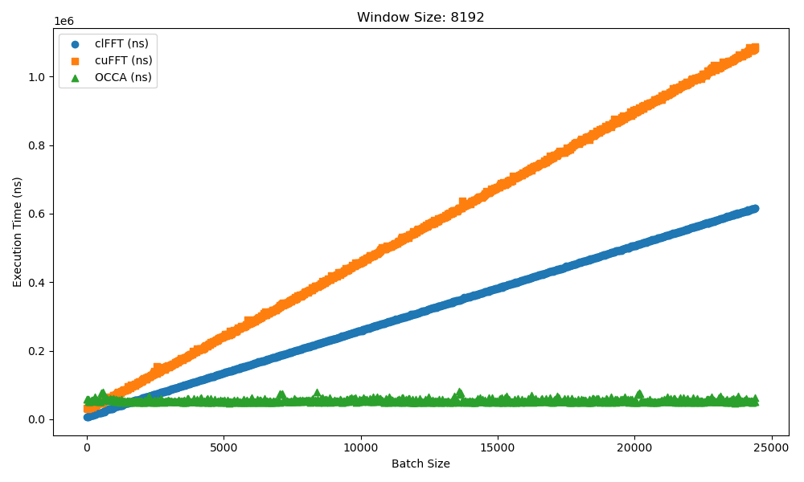
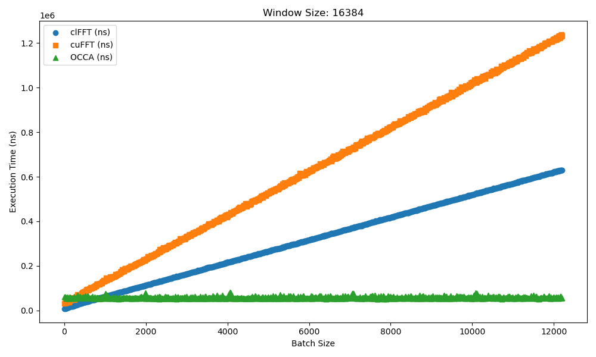
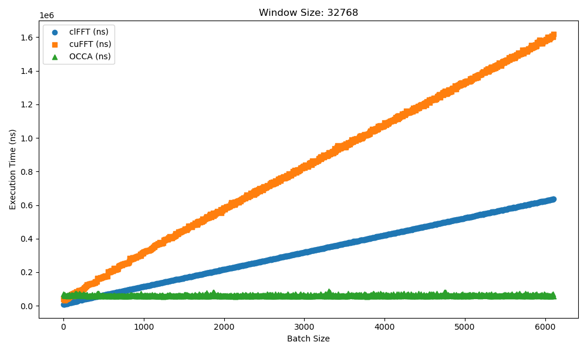
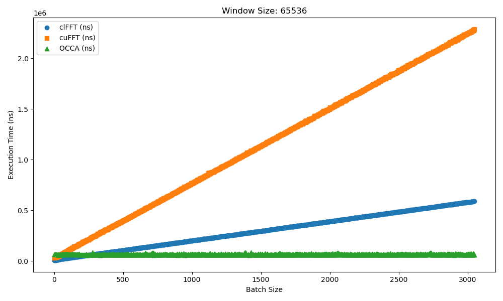


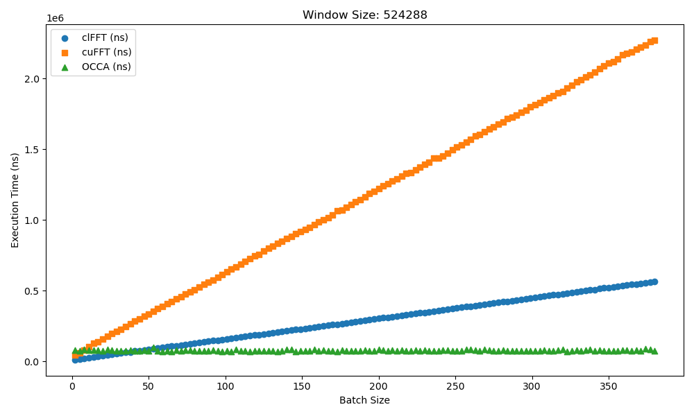
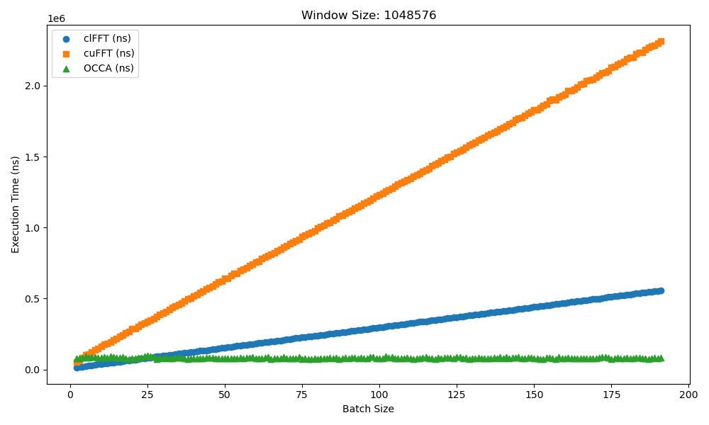

## TEST
- **OCCA**: StandAlone/cross_gpgpu/occaprofileRunner
- **CUFFT**: StandAlone/cross_gpgpu/testRunner (CLFFT code has been Annotated)

how to use
- **1**: build the runners
- **2**: in StandAlone/Profile_Code/profileRunners.cpp, uncomment datawait and build the StandAlone
- **3**: make file named "executeResult.json" related path from runner
- **4**: execute runner port 54500
- **5**: execute TESTER.exe and wait. may be took for a day per one runner.
- **6**: make csv with python code ProfileResults/merged_csv.py ( the json path were hardcoded.)
- **7**: make plot with python code. ProfileResults/window-batch.py (the csv path were hardcoded.)
- "clFFTResultOnNvidiaH100.json" : clfft hardcoded
- "cuFFTResultOnNvidiaH100.json" : cufft hardcoded
- "occaResultOnNvidiaH100.json"  : occa  hardcoded
- "merged_fft_results.csv"       : csv   hardcoded

## Key Features

- **Platform Support**: Supports STFT operations in CUDA, OpenCL, OpenMP, and Serial environments.
- **Modular Codebase**: Provides a modular code structure for each platform, ensuring ease of maintenance and expansion.
- **IXWebSocket-Based Communication**: Manages external communication and asynchronous processing through WebSocket using the IXWebSocket library. Users can request computations from a server through WebSocket connections.
- **OCCA Integration**: Leverages OCCA (Open Concurrent Compute Abstraction) to easily convert and execute kernel code across various parallel computing environments.

## Directory Structure
- **OKL/**: Contains OKL codes.
- **StandAlone/**: Implementation that can operate with just binary distribution.
  - **cross_gpgpu/**: Contains modular implementations for CUDA, OpenCL, OpenMP, and Serial platforms.
    - **GLOBAL/**: default codes for runners.
    - **CUDA/**: GPGPU implementation based on CUDA.
    - **HIP/**: Not implemented yet.
    - **METAL/**: Not implemented yet.
    - **OpenCL/**: GPGPU implementation based on OpenCL.
    - **OpenMP/**: CPU parallel processing implementation based on OpenMP.
    - **Serial/**: Sequential processing implementation without parallelism.
    - **RunnerTemplate/**: Contains template implementations for adding new vendors.
    - **occaprofileRunner/**: A special Runner implementation for performance testing of this implementation. runs with custom fallback.
    - **testRunner/**: Special Runner implementation to extract data from clfft and cufft. runs with custom fallback.
  - **include/**: Header files and utility code used across platforms.
  - **src/**: Core implementation files for STFT and related functionalities.
- **kernel_build.sh**: Script to generate kernel code for various platforms using OCCA.
- **capnpsetter.sh**: Script to set capnproto.
- **nvccPtxBuild.sh**: Script to build ptx file from .cu file.
- **docker_ptx_builder.sh**: Script that can build all ptx in just one run. Requires Docker
- **position_setter_for_docker.sh**: Docker uses this. not for us.
## Installation and Build

### Requirements

- CMake 3.5 or higher
- CUDA Toolkit (optional for CUDA builds)
- OpenCL library (optional for OpenCL builds)
- OpenMP-supported compiler
- CapnProto (library for data serialization and deserialization)
- IXWebSocket (library for WebSocket communication)

### Build Procedure

1. Clone the repository.

   ```bash
   git clone https://github.com/Rliop913/GPGPU_Batch_STFT.git
   cd GPGPU_Batch_STFT
   cd StandAlone
   ```

2. Generate the build using CMake.

   ```bash
   mkdir build
   cd build
   cmake ..
   cmake --build . --parallel 12
   ```
   NOTE: Perhaps your first build will fail related to ixwebsocket. Build it again and it will be resolved.

3. Once the build is complete, executables for each vendor will be generated under the `cross_build/` directory.

   For example, `cross_build/CUDA/cudaRun.exe`, `cross_build/OpenCL/openclRun.exe`, etc.

## OKL Usage
  - **STFT_MAIN.okl**: includes everything
  - **kernel.okl**
    - **toPower**: PostProcess, power(square) datas.
    - **toHalfCoplexFormat** PostProcess, returns halfed complex. (real, imag, real, imag)
  - **EXPCommon**
    - **Window_~~~~**: PreProcess, returns windowed data.
    - **Overlap_Common**: PreProcess, returns overlaped data.
    - **DCRemove_Common**: PreProcess, removes DC components in every windows
    - **StockHamDITCommon**: main kernel, need to call every stage. The stage starts with 0, ends with windowSizeEXP - 1.
  - **EXP~.okl**:Special implementations optimized to use shared memory,
    - **Stockhpotimized~**: main kernel, call once.
## StandAlone Usage
Implementation to ensure normal operation even in a binary distribution environment (non-developer environment)

### Example

1. **Running the Executable**

   To run the WebSocket server using the built executable, use the following command:

   ```bash
   ./cross_build/CUDA/cudaRun.exe 54500
   ```

   This command runs the `cudaRun.exe` program and starts the WebSocket server on port `54500`.

2. **Using the STFTProxy Object**

   The following is an example of using the `STFTProxy` object to manage the executable and set up WebSocket communication:

   ```cpp
   #include "STFTProxy.hpp"
   #include <iostream>
   #include <vector>

   int main() {
       // Add expected executable paths to FallbackList and set server information
       FallbackList list;
       list.OpenMPFallback.push_back("./cross_gpgpu/OpenMP");
       list.SerialFallback.push_back("./cross_gpgpu/Serial");
       list.ServerFallback.push_back("127.0.0.1:54500");
       list.CustomFallback.push_back("./path_to_your_custom_runner/yourRunner.exe");//NOTE: It works without problem even without the exe extension.

       // Define WebSocket error handling function
       auto temp = STFTProxy([](const ix::WebSocketErrorInfo& err)
       {
           std::cout << err.reason << std::endl;
       }, list);

       // Create test data
       std::vector<float> testZeroData(10000);
       for (int i = 0; i < testZeroData.size(); ++i)
       {
           testZeroData[i] = float(i) / testZeroData.size() + 1.0f;
       }

       // Request STFT operation
       auto promisedData = temp.RequestSTFT(testZeroData, 10, 0.5 , "--hanning_window --half_complex_return");
   
       // RequestSTFT( FloatVector, windowSizeEXP, OverlapRate, Options)
       // FloatVector: float vector
       // windowSizeEXP: EXP data of WindowSize. 2 ^ windowSizeEXP
       // OverlapRate: overlap rate. 0.6 means 60% overlap
       // Options: options for preprocess, returned shape.
   
       if (promisedData.has_value()) // checks promise
       {
           auto resOut = promisedData.value().get(); // get data from promise
           if (resOut.has_value()) // checks data from promise.
           {
               // Use the result
           }
       }

       getchar();

       // Safely close the running Runner (only works if the proxy object directly started the Runner)
       // Note: If the proxy starts the Runner directly, the proxy and Runner can use shared memory between processes, providing faster execution.
       if (temp.KillRunner())
       {
           std::cout << "safe closed" << std::endl;
       }
       else
       {
           std::cerr << "not closed" << std::endl;
       }

       return 0;
   }
   ```

   This code demonstrates how to manage executables and set up WebSocket communication for STFT processing. The `KillRunner` function works **only if the proxy object directly started the Runner** and requests a safe shutdown. Additionally, if the proxy starts the Runner directly, the proxy and Runner can use shared memory between processes, enabling faster execution.
## Available Options
- **PreProcess**

    **--hanning_window**: hanning window

    **--hamming_window**: hamming window

    **--blackman_window**: blackman window

    **--nuttall_window** : nuttall window

    **--blackman_nuttall_window** : As written

    **--blackman_harris_window** : As written

    **--flattop_window** : As written

    **--gaussian_window=(sigmaSize)<<sigma**: gaussian window. Enter the sigma value to use it.
  
    e.g. --gaussian_window=4.312345<<sigma

    **--remove_dc**: removes the DC component within the window.

- **PostProcess**

    **--half_complex_return**:  leverages the symmetry of the FFT output to remove the redundant second half of the complex result. Since memory and communication primarily use float arrays, this option packs the real and imaginary components alternately (real, imaginary, real, imaginary) in the available space, thereby reducing memory usage and ensuring compatibility."

    **no postprocess option mentioned(default)**: returns the squared (power) value.

## Customizing StandAlone Runner

### Customize a Runner

If you want to add a new vendor or other implementation to this project, please follow these steps. The template files in the `RunnerTemplate` folder will help you get started quickly with vendor-specific implementations.

Contributions, especially PRs implementing **Metal** and **HIP** support, are highly encouraged!

### 1. Create a New Vendor Directory

- First, create a directory for the new vendor under `cross_gpgpu/`. For example, if the new vendor is "MyVendor", create the directory as follows:

   ```bash
   mkdir cross_gpgpu/MyVendor
   ```

### 2. Copy RunnerTemplate

- Copy the template files from the `RunnerTemplate` folder to the new vendor directory.

   ```bash
   cp -r cross_gpgpu/RunnerTemplate/* cross_gpgpu/MyVendor/
   ```
### 3. Modify `functionImpl.cpp`
- `functionImpl.cpp` is the core implementation file for the new vendor. implement it with kernel code.
  ```cpp
  #include "RunnerInterface.hpp"

  bool 
  runnerFunction::Overlap(
      void* userStruct, 
      void* origin, 
      CUI OFullSize, 
      CUI FullSize, 
      CUI windowSizeEXP, 
      CUI OMove, 
      void* Realout
      )
  {
      
  }
  
  
  
  bool 
  runnerFunction::Hanning(void* userStruct, void* data, CUI OFullSize, CUI windowSize)
  {
      
  }
  
  bool 
  runnerFunction::Hamming(void* userStruct, void* data, CUI OFullSize, CUI windowSize)
  {
      
  }
  
  bool 
  runnerFunction::Blackman(void* userStruct, void* data, CUI OFullSize, CUI windowSize)
  {
      
  }
  
  bool 
  runnerFunction::Nuttall(void* userStruct, void* data, CUI OFullSize, CUI windowSize)
  {
      
  }
  
  bool 
  runnerFunction::Blackman_Nuttall(void* userStruct, void* data, CUI OFullSize, CUI windowSize)
  {
      
  }
  
  bool 
  runnerFunction::Blackman_Harris(void* userStruct, void* data, CUI OFullSize, CUI windowSize)
  {
      
  }
  
  bool 
  runnerFunction::FlatTop(void* userStruct, void* data, CUI OFullSize, CUI windowSize)
  {
      
  }
  
  bool 
  runnerFunction::RemoveDC(void* userStruct, void* data, CUI qtConst, CUI OFullSize, CUI windowSize)
  {
      
  }
  
  bool 
  runnerFunction::Gaussian(
      void* userStruct, 
      void* data, 
      CUI OFullSize, 
      CUI windowSize, 
      const float sigma
      )
  {
      
  }
  
  
  bool 
  runnerFunction::EXP6(void* userStruct, void* Real, void* Imag, CUI OHalfSize)
  {
      
  }
  
  bool 
  runnerFunction::EXP7(void* userStruct, void* Real, void* Imag, CUI OHalfSize)
  {
      
  }
  
  bool 
  runnerFunction::EXP8(void* userStruct, void* Real, void* Imag, CUI OHalfSize)
  {
  
  }
  
  bool 
  runnerFunction::EXP9(void* userStruct, void* Real, void* Imag, CUI OHalfSize)
  {
  
  }
  
  bool 
  runnerFunction::EXP10(void* userStruct, void* Real, void* Imag, CUI OHalfSize)
  {
  
  }
  
  bool 
  runnerFunction::EXP11(void* userStruct, void* Real, void* Imag, CUI OHalfSize)
  {
  
  }
  
  
  bool 
  runnerFunction::EXPC(
      void*   userStruct,
      void*   real, 
      void*   imag,
      void*   subreal,
      void*   subimag,
      void*   out,
      CUI&&   HWindowSize,
      CUI     windowSizeEXP,
      CUI     OFullSize,
      void*   realResult,
      void*   imagResult
      )
  {
      
  }
  
  
  bool 
  runnerFunction::HalfComplex(   
      void*   userStruct, 
      void*   out, 
      void*   realResult, 
      void*   imagResult, 
      CUI     OHalfSize, 
      CUI     windowSizeEXP
      )
  {
      
  }
  
  
  bool 
  runnerFunction::ToPower(   
      void* userStruct, 
      void* out, 
      void* realResult, 
      void* imagResult, 
      CUI OFullSize
      )
  {
      
  }
  ```

### 4. Modify `TemplateImpl.cpp`

- `TemplateImpl.cpp` is the core implementation file for the new vendor. Below is a key portion of this file:

   ```cpp
   #include "RunnerInterface.hpp"
  //include your gpgpu kernel codes.
  
  
  /*
  IMPLEMENTATION LISTS
  
  1. make Genv
  2. make Gcodes
  3. implement BuildKernel, ActivateSTFT
  4. End. try test
  
  */
  
  
  
  // Genv: Structure to hold the GPGPU environment settings and resources.
  struct Genv{
      //
  };
  
  // Gcodes: Structure to manage and store GPGPU kernel codes.
  struct Gcodes{
      //
  };
  
  // InitEnv: Initializes the GPGPU environment and kernel code structures.
  // Allocates memory for 'env' (Genv) and 'kens' (Gcodes).
  void
  Runner::InitEnv()
  {
      env = new Genv;
      kens = new Gcodes;
  }
  
  // BuildKernel: Compiles or prepares the GPGPU kernel for execution.
  void
  Runner::BuildKernel()
  {
      //
  }
  
  void
  Runner::UnInit()
  {
      //
  }
  
  /**
   * ActivateSTFT: Executes the Short-Time Fourier Transform (STFT) on the input data using GPGPU.
   * @param inData: Input signal data.
   * @param windowSizeEXP: EXP of the STFT window.
   * @param overlapRatio: Overlap ratio for the STFT window. 0 ~ 1, 0 means no overlap.
   * @return MAYBE_DATA: Processed data after applying STFT. if error occurs, return std::nullopt
   */
  
  MAYBE_DATA
  Runner::ActivateSTFT(   VECF& inData, 
                          const int& windowSizeEXP, 
                          const float& overlapRatio)
  {
      //default code blocks
      const unsigned int  FullSize    = inData.size();
      const int           windowSize  = 1 << windowSizeEXP;
      const int           qtConst     = toQuot(FullSize, overlapRatio, windowSize);//number of windows
      const unsigned int  OFullSize   = qtConst * windowSize; // overlaped fullsize
      const unsigned int  OHalfSize   = OFullSize / 2;
      const unsigned int  OMove       = windowSize * (1.0f - overlapRatio);// window move distance
      //end default
  
      runnerFunction::Default_Pipeline //use this after implement functionImpl.cpp
      (
          nullptr,// your custom struct
          &inData,
          &Real,// alloc your memory
          &Imag,// alloc your memory
          &subReal,// alloc your memory
          &subImag,// alloc your memory
          &outMem,// alloc your memory
          std::move(FullSize),
          std::move(windowSize),
          std::move(qtConst),
          std::move(OFullSize),
          std::move(OHalfSize),
          std::move(OMove),
          options,
          windowSizeEXP,
          overlapRatio
      );
  
      return std::move(outMem); // If any error occurs during STFT execution, the function returns std::nullopt.
  }
   ```

   Modify the `Genv` and `Gcodes` structures to suit the new vendor, and implement the `BuildKernel` and `ActivateSTFT` functions.

### 4. CMake Configuration

- Modify a `CMakeLists.txt` file in the new vendor directory to define the build settings. For example:

---

By adding a new vendor, this project can support a broader range of environments for STFT processing. If you need further assistance, feel free to reach out.
